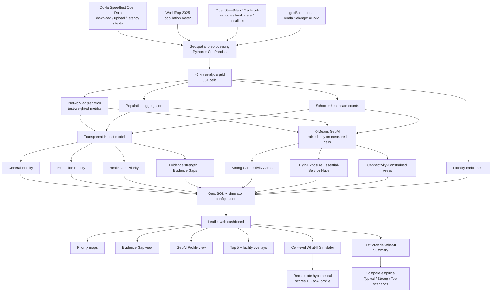

# Signal Lah — Architecture & Responsible GeoAI

## 1. System Architecture

---

## 2. What the AI Actually Does

Signal Lah does **not** use AI to calculate the priority score.

The priority score is intentionally transparent and derived from observed network performance and community/service exposure.

The AI component is a **K-Means clustering model** used to discover recurring connectivity-community patterns.

### K-Means input features

The model is trained only on cells with observed network measurements using:

1. average download speed;
2. average upload speed;
3. average latency;
4. log-transformed population;
5. mapped-school count; and
6. mapped-healthcare count.

### Final GeoAI profiles

The validated `K = 3` model produces:

- **Strong-Connectivity Areas**
- **High-Exposure Essential-Service Hubs**
- **Connectivity-Constrained Areas**

Cells without observed network measurements are not imputed into the model. They are labelled:

> **Unclassified – Evidence Gap**

This avoids presenting an AI-generated connectivity profile where supporting network evidence is unavailable.

---

## 3. Why AI Is Useful Here

The transparent impact model answers:

> **Where should attention be prioritised?**

The GeoAI model answers:

> **What recurring type of connectivity-community pattern does this area resemble?**

The simulator then asks:

> **If connectivity outcomes improved, how might the priority score and learned profile change?**

This keeps the model useful without making it responsible for decisions that can be explained more clearly using transparent calculations.

---

## 4. Evidence-Aware Design

A major principle of Signal Lah is:

> **No observed network measurement does not mean good connectivity, and it does not mean poor connectivity.**

The final Kuala Selangor pilot contains:

- **331** analysis cells;
- **182** cells with observed network measurements; and
- **149** Evidence Gap cells.

Evidence Gap cells are therefore shown separately instead of being automatically classified as Low Priority or assigned a GeoAI profile.

For measured cells, evidence strength is also kept separate from impact priority. This allows Signal Lah to distinguish:

- **High priority – supported**
- **High priority – validate evidence**
- **Evidence Gap**

This encourages additional validation where evidence is limited.

---

## 5. What the Simulator Does — and Does Not Do

### The simulator does

For a measured cell, a user can enter hypothetical:

- download speed;
- upload speed; and
- latency.

Signal Lah then recalculates:

- connectivity-gap score;
- General impact score;
- Education impact score;
- Healthcare impact score;
- relative priority tier; and
- GeoAI profile under the hypothetical connectivity outcome.

The dashboard also provides empirical **Typical**, **Strong** and **Top** observed scenarios for district-wide comparison.

### The simulator does not

Signal Lah does **not** predict:

- tower placement;
- RF propagation;
- signal strength;
- infrastructure construction cost;
- exact network-upgrade performance; or
- guaranteed beneficiaries.

It is a **connectivity-outcome simulator**, not a telecommunications engineering or propagation model.

---

## 6. Responsible GeoAI Principles

### Fairness and representativeness

Ookla observations are crowdsourced and may be unevenly distributed. Areas with fewer observations are not assumed to have better or worse connectivity.

### Transparency

Priority scores are calculated using a transparent, reproducible impact model rather than an opaque AI prediction.

### Uncertainty

Evidence strength is displayed separately from impact priority. Missing evidence is explicitly represented as an Evidence Gap.

### Human oversight

Signal Lah is designed for decision support. Real infrastructure decisions should still include field verification, engineering analysis and stakeholder review.

### Data minimisation and privacy

The prototype works with aggregated grid-level network and community information rather than household-level personal data.

### Explainability

Users can inspect observed network metrics, population/service exposure, evidence status, priority scores and GeoAI profile descriptions directly in the dashboard.

---

## 7. Key Limitations

1. **Ookla data is observational**
   - Speedtest measurements are crowdsourced and do not represent complete network coverage.

2. **Evidence Gaps remain unknown**
   - Signal Lah deliberately avoids inferring whether unmeasured cells have good or poor connectivity.

3. **OSM facilities are mapped features**
   - The 105 schools and 64 healthcare facilities are OSM-mapped facilities, not guaranteed complete official registers.

4. **Population is estimated**
   - Population exposure is derived from WorldPop 2025 modelled raster estimates.

5. **Priority is relative**
   - High / Medium / Low priority categories are relative within the Kuala Selangor pilot and are not MCMC regulatory service classifications.

6. **GeoAI profiles are descriptive**
   - K-Means clusters are recurring patterns, not ground-truth labels.

7. **One cluster is more transitional**
   - The High-Exposure Essential-Service Hub profile has weaker cluster separation than the other two profiles, so assignments should be interpreted cautiously.

8. **Simulator outputs are hypothetical**
   - Scenario results describe what happens to the model if connectivity outcomes change; they do not guarantee that an intervention will achieve those outcomes.

---

## 8. Scalability

Kuala Selangor is a pilot, not a fixed endpoint.

The same workflow can be transferred to another Malaysian district by:

1. loading the new administrative boundary;
2. aggregating equivalent network observations;
3. aggregating local population and mapped essential services;
4. rebuilding the analysis grid;
5. recalculating empirical priority thresholds;
6. retraining and validating the GeoAI profiles where appropriate; and
7. exporting the new data to the same lightweight web dashboard.

### Important scalability safeguard

Signal Lah should **not blindly reuse Kuala Selangor thresholds or cluster profiles in a new district**.

Local distributions and community contexts can differ, so recalibration and validation are part of responsible scaling.

---

## 9. Judge-Friendly Summary

### Problem
Connectivity maps show where network performance is weak, but not necessarily where weak connectivity has the greatest community impact.

### Solution
Signal Lah combines observed mobile-network performance, population, schools and healthcare into a transparent geospatial priority model.

### GeoAI
K-Means discovers recurring connectivity-community profiles from measured cells.

### Responsible AI
Unmeasured cells are preserved as Evidence Gaps rather than receiving invented connectivity estimates or AI labels.

### Innovation
Signal Lah combines:
- impact prioritisation;
- evidence-gap awareness;
- GeoAI profiling; and
- before/after what-if simulation.

### Value
The prototype helps communities, local authorities and telecommunications stakeholders explore **where additional evidence or connectivity intervention may matter most**.
